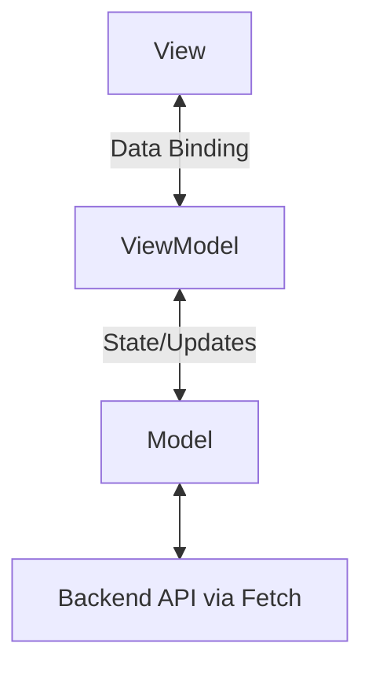

# Architecture

The Qatu Marketplace frontend uses the **MVVM (Model-View-ViewModel)** architectural pattern.

## MVVM Components

- **Model (`models/`)**: Data entities, API clients (using Fetch API), and validation logic.
- **View (`views/`)**: HTML templates, CSS styles, and component rendering logic.
- **ViewModel (`viewmodels/`)**: Presentation logic, state management, and data bindings between Models and Views.

## Other Components

- **Router (`router/`)**: Client-side routing.
- **Store (`store/`)**: State management (custom observable store).

## Technologies

- **Vite**: Fast build tool and development server (ADR-007).
- **Jasmine**: Testing framework (ADR-006).

## Diagram

