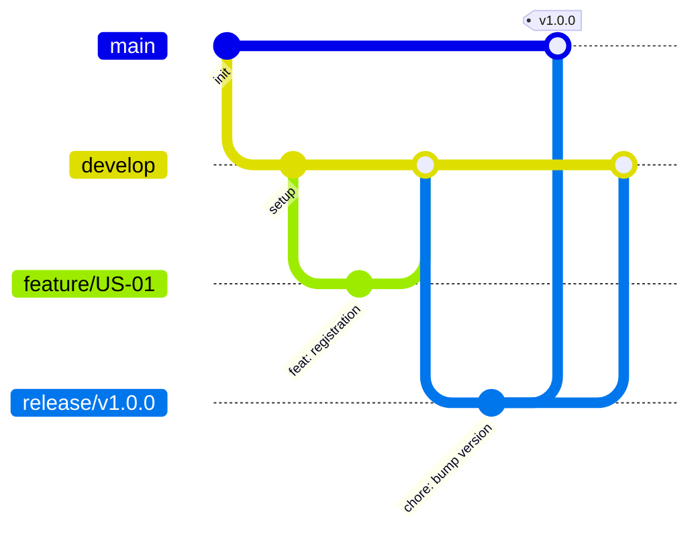

# Git Rules

## 3.1 Branching Strategy (GitFlow)

- **`main`:** Production-ready code. Only accepts merges from `release/*` or `hotfix/*`. Protected branch.
- **`develop`:** Integration branch. All feature branches merge here. Protected branch.
- **`feature/*`:** One branch per user story or task. Naming convention: `feature/US-XX-short-description` (e.g., `feature/US-01-buyer-registration`).
- **`release/*`:** Release preparation. Naming convention: `release/vX.Y.Z`.
- **`hotfix/*`:** Urgent production fixes. Naming convention: `hotfix/short-description`.



## 3.2 Commit Message Convention (Conventional Commits)

- **Format:** `<type>(<scope>): <description>`
- **Types:** `feat`, `fix`, `docs`, `style`, `refactor`, `perf`, `test`, `build`, `ci`, `chore`, `revert`.
- **Scope:** Optional, but recommended (e.g., `feat(auth): add login form`).
- **Breaking changes:** Add `BREAKING CHANGE:` in the footer or `!` after type/scope.
- **Good Example:** `feat(auth): add JWT storage logic`
- **Bad Example:** `fixed login`

## 3.3 Merge Request Guidelines

- Every MR must reference an issue (e.g., `Closes #12`).
- At least 1 approval required.
- All CI checks must pass.
- No direct commits to `main` or `develop`.
- Use squash merge for feature branches.
- Delete the feature branch after merging.

## 3.4 Code Review Checklist

- Code follows the Definition of Done.
- Tests are included and passing.
- Linting and formatting pass.
- No secrets committed.
- Wiki updated if architectural decisions changed.

## 3.5 Remote Configuration

- `origin` → GitLab (primary).
- `github` → GitHub (mirror).

Push to both remotes:

```bash
git push origin develop
git push github develop
```

## 3.6 Common Git Commands

- **Create a feature branch:** `git checkout -b feature/US-XX-description develop`
- **Commit:** `git commit -m "feat(scope): description"`
- **Push:** `git push origin feature/US-XX-description`
- **Sync with develop:** `git checkout develop && git pull origin develop`
